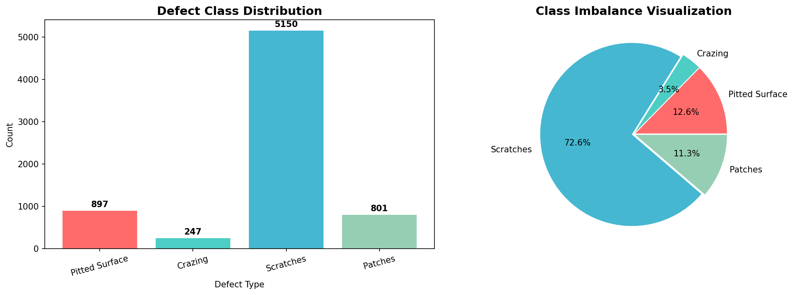
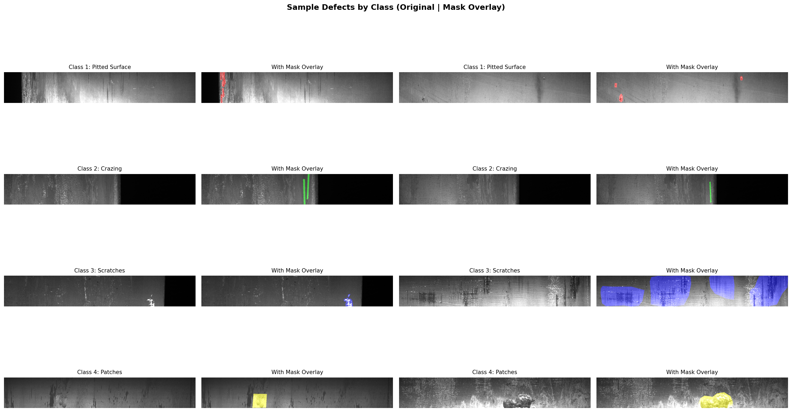
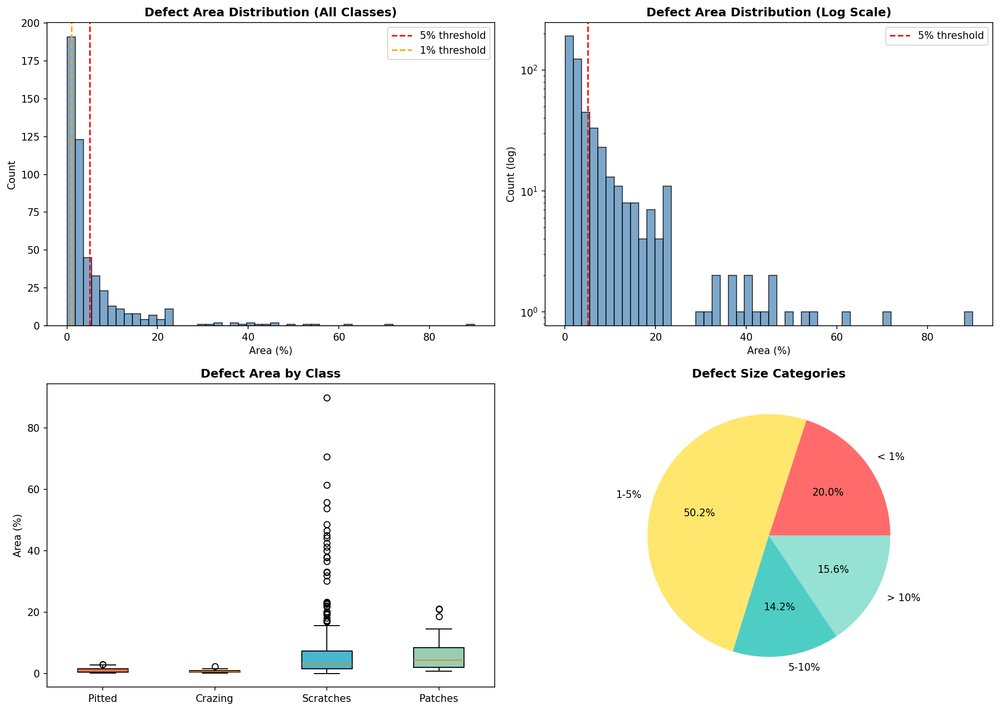
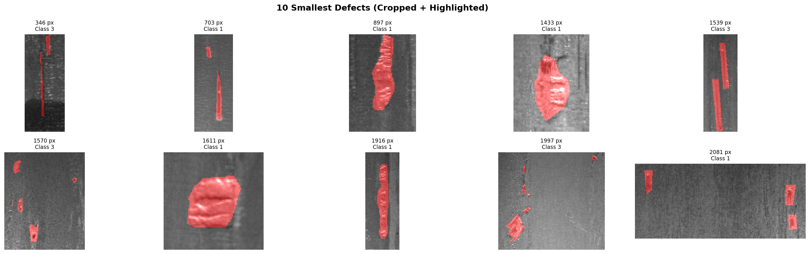

# Phase 1: EDA Report - Severstal Steel Defect Dataset

## Dataset Overview

| Metric | Value |
|--------|-------|
| Total Training Images | 12,568 |
| Defective Images | 6,666 |
| Image Resolution | 256 × 1600 pixels |
| Total Pixels per Image | 409,600 |

---

## 1. Class Distribution

| Class | Defect Type | Count | Percentage |
|-------|-------------|-------|------------|
| 1 | Pitted Surface | 897 | 12.6% |
| 2 | Crazing | 247 | 3.5% |
| 3 | Scratches | 5150 | 72.6% |
| 4 | Patches | 801 | 11.3% |

> [!WARNING]
> **Severe Class Imbalance**: Class 3 (Scratches) dominates at ~75%, while Class 2 (Crazing) is only ~3%.

---

## 2. Sample Defects with Mask Overlays

---

## 3. Defect Area Distribution

### Key Statistics

| Metric | Value |
|--------|-------|
| Minimum Area | 0.0625% |
| Maximum Area | 89.90% |
| Mean Area | 6.03% |
| Median Area | 2.69% |

### Size Categories

| Category | Count | Percentage |
|----------|-------|------------|
| < 1% of image | 100 | 20.0% |
| 1-5% of image | 251 | 50.2% |
| 5-10% of image | 71 | 14.2% |
| > 10% of image | 78 | 15.6% |

> [!CAUTION]
> **Critical Finding**: Many defects are TINY (< 1% of image area). Blind resizing will lose these defects!

---

## 4. Minimum Defect Size Analysis

| Metric | Value |
|--------|-------|
| Smallest Defect | 346 pixels |
| 5th Percentile | 30 pixels (min dimension) |

---

## 5. Conclusions

### What Will Work
- ✅ Detecting Class 3 (Scratches) - abundant data, visible patterns
- ✅ Detecting large/medium defects with clear boundaries
- ✅ Binary classification (defect vs no-defect)

### What Will Struggle
- ❌ Detecting Class 2 (Crazing) - only 3% of data
- ❌ Tiny defects after resizing - WILL BE LOST
- ❌ Fine cracks and small pits

### Design Implications
1. **Tiling/Patch-based approach is MANDATORY** - cannot use full-image resize
2. **Class weighting required** - severe imbalance
3. **Recall-focused training** - small defects must not be missed

---

## Next Phase
→ **Phase 2: Risk Mapping & Design Constraints** - Lock preprocessing decisions
