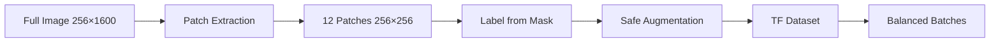

# Phase 3: Preprocessing Strategy Design Document

## Steel Defect Detection System | Technical Specification

---

## 1. Patch-Based Approach (LOCKED)

### Why Not Full-Image Resize?

| Original | Resize to 256×256 | Impact |
|----------|------------------|--------|
| 256×1600 | 256×256 | 6.25× width compression |
| 13px defect | ~2px defect | INVISIBLE |

> **Conclusion**: Full-image resize destroys small defects. Patching is MANDATORY.

---

## 2. Tiling Configuration

| Parameter | Value | Rationale |
|-----------|-------|-----------|
| Patch Size | 256×256 | Standard CNN input, maintains full height |
| Stride | 128×128 | 50% overlap ensures edge coverage |
| Patches/Image | ~12 | Full coverage of 256×1600 |

```
Image: [========================================] 256×1600
        |_patch1__|
              |_patch2__|
                    |_patch3__| ... (12 patches with 50% overlap)
```

---

## 3. Patch Label Generation

### Binary Classification
```python
if defect_pixels >= 50 OR defect_ratio >= 0.1%:
    label = 1  # DEFECTIVE
else:
    label = 0  # CLEAN
```

### Why These Thresholds?
- **50 pixels minimum**: Filters noise, keeps real defects
- **0.1% ratio**: Even tiny defects in 256×256 patch are significant

---

## 4. Safe Augmentations (Defect-Preserving)

### ✅ ALLOWED
| Augmentation | Probability | Reason |
|--------------|-------------|--------|
| Horizontal Flip | 0.5 | Defects remain defects |
| Vertical Flip | 0.5 | Defects remain defects |
| Brightness/Contrast | 0.3 | Simulates lighting variation |
| Gaussian Noise | 0.2 | Simulates sensor noise |

### ❌ REJECTED
| Augmentation | Reason |
|--------------|--------|
| Random Erasing | Might erase defects |
| Heavy Rotation | Distorts thin scratches |
| Aggressive Crop | Might remove defects |
| Cutout/Mixup | Destroys defect patterns |

---

## 5. Pipeline Summary



---

## 6. Expected Output

| Metric | Estimate |
|--------|----------|
| Train images | ~5,300 |
| Train patches | ~63,600 |
| Test images | ~1,300 |
| Test patches | ~15,600 |
| Defective patches | ~30-40% |

---

## Component Files

- `data_transformation.py` - Main transformation component
  - `PatchExtractor` - Extracts 256×256 patches
  - `SafeAugmentation` - Defect-preserving augmentations
  - `DataTransformation` - Complete pipeline

---

## Next Phase
→ **Phase 4: Modeling Strategy** - Build baseline and transfer learning models
